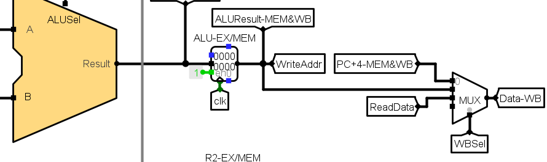
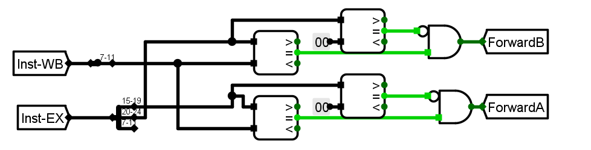
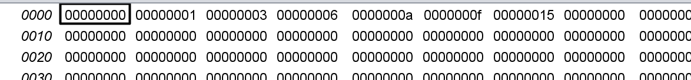

# 体系结构lab1 设计文档

### part A RISC-V三段理想流水

##### 0. 简介

 RISC-V经典的五级流水如下

| 序号 | 步骤                               | 功能                                                         |
| ---- | ---------------------------------- | ------------------------------------------------------------ |
| 1    | 取指令（IF，Instruction Fetch）    | 将指令从存储器中读取出来。                                   |
| 2    | 指令译码（ID，Instruction Decode） | 将从存储器中取出来的指令进行翻译，经过译码后得到指令需要的操作数寄存器索引，可以使用此索引从通用寄存器组（Register File，Regfile）中将操作数读出。 |
| 3    | 指令执行（EX，Execute）            | 对指令进行运算。                                             |
| 4    | 访存（MEM，Memory Access）         | 存储器访问指令将数据从存储器中读出，或者写入存储器。         |
| 5    | 写回（WB，Write Back）             | 将指令执行的结果写回通用寄存器组。如果是普通运算指令，该结果值来自于“执行”阶段计算的结果；如果是存储器读指令，该结果来自于“访存”阶段从存储器中读取出来的数据。 |

 要想实现三级流水，可以直接选择合并其中的部分阶段。本实现中，选择合并IF和ID、MEM和WB。即`IF&ID` || `EX`|| `MEM&WB`。

 流水线通过流水接口部件（主要为寄存器）为后段提供数据信息和控制信息。不同的流水接口部件锁存的数据和控制信号不同，具体可根据前后段之间的交互信息进行考虑。下面分阶段介绍每个阶段内用到的实现PART A理想流水的流水部件。

##### 1. IF&ID

 合并了IF和ID阶段后，主要需要加入流水部件的数据信号有`PC`、`Instruction`、`R1`和`R2`。所有在ID阶段产生的控制信号都用于EX、MEM或WB阶段，所以也需要通过流水部件存取及转发到产生控制作用的阶段。

 

##### 2. EX

 在EX阶段，主要有ALU、ImmGen和BranchComp部件参与运行计算。其中输入的数据信号 `R1`、`R2`需要在IF/EX之间加入流水寄存器。

 另外，这些部件正常运行所必需的控制信号`ASel`,`BSel`,`BrUN`,`ImmSel`,`ALUSel`也需要通过流水部件寄存，以在EX阶段提供正确的控制信号。

##### 3. MEM&WB

 在MEM&WB阶段主要实现访存和结果写回寄存器。主要的数据输入有

1. 可能作为访存指令的内存地址的`ALUResult`
2. 跳转指令中作为写回数据的选择项`PC_4`和`ALUResult`

 而在此阶段产生作用的控制信号包括用于访存读写控制的`MemR`,`MemW`；用于写回寄存器的`WBSel`,`RegWEn`，它们从IF阶段到MEM/WB需要经过EX，所以要通过两级流水部件。

##### 4. 运行结果

 将理想流水.hex加载入IMEM，运行结果如下。

 执行的指令共有19条，在单周期CPU上运行总周期数就是19。而对于3级流水CPU，相比之下第一条指令会多出两个周期，而后面的指令都是以流水方式进行，所以总共为21个周期。

### part B 分支冒险

 解决分支问题的关键在于妥善处理`Branch`信号。在执行分支时，修改后的PC值可能等于PC+4，也可能等于跳转到的地址（若分支执行），但是控制是否发生跳转的`Branch`信号在EX阶段才能形成，即在本实验的三级流水条件下，要到下条指令的IF&ID（取指令）阶段过后才能知道是否要发生跳转。而若发生跳转，后面的已经在运行的指令就变成了失效指令。

 处理分支最简单的方法是插入气泡(bubble)，即如果上条指令的`Branch`信号为1，则下条指令插入nop指令，这相当于冻结流水线，直到知道分支目标，即PC取到跳转分支的地址为止。这需要在原来的基础上作出以下调整：

 加入添加气泡的部件，若`branch`为1，则插入0x00000013(nop)

 缓存`Branch`信号，在此处缓存的是ID阶段产生的`PCSel`信号，因为`BrEQ`和`BrLT`本身就是EX阶段产生的信号，不需要缓存直接使用。

 **运行结果**

 如下图，可以看到7段数码管会显示从1F、1E、1C……、1、0、1F、1E ……依次轮回显示。

### 附加题 数据冒险

实现数据冒险处理电路，使得能运行数据相关的测试程序。

- 执行“数据相关测试.asm”测试程序
- 程序效果：程序最终完成等差数列求和部分运算，并在结果写到RAM存储器中。

 一般来说，上一条指令完成后寄存器的值尚未写回（即还未到WB阶段）之前，下条指令在ID阶段已经把该寄存器的值读取出来，这一问题称为**数据冒险**。

 解决数据相关问题的最简单方法是转发(forwarding)，对于本实验的三级流水，其工作方式如下所述

1. 来自EX/MEM&WB流水线寄存器的ALU结果总是被反馈回ALU的输入端
2. 如果转发硬件检测到前一个ALU操作已经对当前ALU操作的源寄存器进行了写入操作，则控制逻辑选择转发结果作为ALU输入，而不是选择从寄存器堆中读取的值

 对于本实验，其电路实现如下：

 即，在`ASel`和`Bsel`之前，在流水部件后，加入Forward选择器。通过比较上条处在WB阶段的指令用到的目的寄存器和当前处在EX指令的寄存器（两个源寄存器）之一是否相等，若为同一个寄存器，则通过`ForwardA`,`ForwardB`信号控制ALU的结果代替取到的对应的源寄存器值，比较电路如下图。

**运行结果**

 加载`数据相关测试.hex`到IMEM中，运行结束后，RAM结果如下：

 可见是正确的等差数列`[0,1,2,3,4,5,6]`的前项和，说明转发器成功解决了数据相关问题。