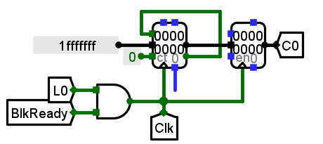

# 体系结构lab2 设计文档


### part A 实现一个直接相联Cache

 由于只实现了16位地址空间的ROM，对于8行直接相联、每行16字节的cache，其TIO(tag,index,offset)分布为 11|3|2，即` Tag`[15-5]，`Index`[4-2]，`Offset`[1-0]。


##### 0. Cache行设计

由于已经给出了一个Cache行参考电路，将其复制7份，分别修改其中信号的隧道标签使其构成有效的电路即可。以L0为例如下


##### 1. 行索引译码器子电路


 行选电路输入为`index`(字节地址的4-2位)，通过一个译码器生成8个行选信号。

##### 2.tag比较子电路


 tag比较电路主要判断是否命中，进而生成`Miss`信号。如果当前选中的行对应的`TagData`与`Tag`相等，且对应Valid=1说明命中，否则为miss，根据这一逻辑连接比较子电路。

##### 3.字选择输出子电路


字选择电路很简单，通过`Offset`选定对应字作为`DataOut`输出

##### 4. 运行结果

part A的运行结果如下，由于A，B均为8*8矩阵，单位为int(4字节)，在内存中的地址恰好对应到cache同一行，计算时会相互冲突，每次计算加法都是”读入A“-”读入B 同时挤出A“的流程。所以，Cache缺失次数达到最大值128次。


### part B 利用缓存机制优化矩阵加法运算

在本实验中，不改变直接相联电路的情况下，减少MissNumber主要有两种思路：

1. 改变矩阵A，B在内存中的地址，使得A、B相同下标数据对应到Cache后不在同一行；同时修改汇编代码读取地址相关的部分
2. 直接修改汇编代码，在矩阵A的16字节加载入Cache的一行后，一次直接读取到4个寄存器中，B同理。然后对4组寄存器再相加求值，从而避免了A、B交叉读取带来的冲突。

理论上，两种方法都可以将缓存的MissNumber降到最小（32次）

我选择第二种方法，修改后的代码见 [Cache测试-partB.asm](./test code/Cache测试-partB.asm)

修改的部分主要是把一次读取一个数变为读取四个，并把”写到TTY“封装为子程序，连续调用四次。

```asm
	...
	lw a0,0(t1)     # 读出A[i * M + j]的值
    lw a1,4(t1)
	lw a2,8(t1)
    lw a3,12(t1)
	...
    lw a4,0(t5)     # 读出B[i * M + j]的值
    lw a5,4(t5)
    lw a6,8(t5)
    lw a7,12(t5)
	
    add a0,a0,a4   # A + B
    #sw s10,0(t0)   # 将 A + B的结果存储到RAM中
    jal ASCII_loop
	add a0,a1,a5
	jal ASCII_loop
    add a0,a2,a6
    jal ASCII_loop
    add a0,a3,a7
    jal ASCII_loop

    addi s9,s9,4        # j++
    bne s9,s8,m2        # 循环
	...

```

修改代码后，加载入IMEM，运行结果如下:


### 附加题

#### 1. 相联映射+LRU调度

请在以下2种组合中任选一组进行电路实现，并在SoC电路中进行命中率测试，Cache总容量：128B。

（1）全相联映射（8路组相联），LRU调度。

（2）组相联映射（2路组相联，4路组相联二选一），LRU调度。




#### 2. 矩阵转置加法

给定矩阵A[16] [16]，实现矩阵加法运算：

矩阵B = 矩阵A + 矩阵A的转置

使得Cache的不命中率Miss Number尽可能少。

